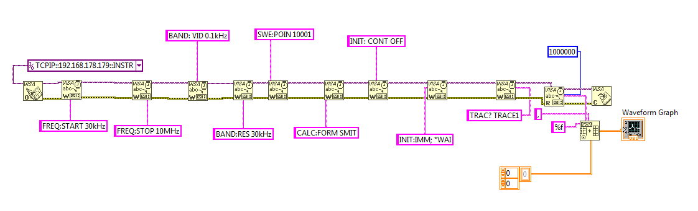
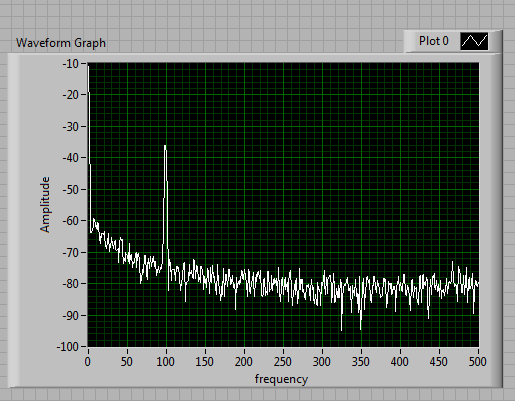
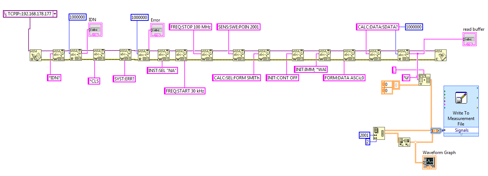
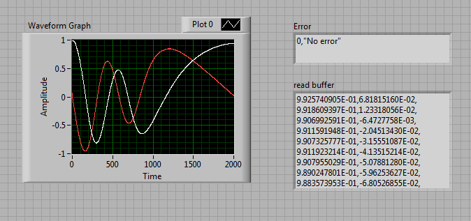

# Measurement_Automation_Lab

Measurement_Automation_Lab is a repository containing resources, experimental data, and scripts for automating measurement processes with various instruments like Vector Network Analyzers (VNA), Spectrum Analyzers, and Oscilloscopes.

## Features
- Data files from different measurement devices.
- MATLAB scripts for processing and analyzing measurement data.
- Documentation and experiment results.

## File Structure
```
Measurement_Automation_Lab/
├── NanoVNA/
│   ├── bal_O.s1p                # Balanced open calibration data
│   ├── bal_S.s1p                # Balanced short calibration data
│   ├── bal_T.s1p                # Balanced through calibration data
│   ├── cab_O.s1p                # Cable open calibration data
│   ├── cab_S.s1p                # Cable short calibration data
│   ├── calibration_isolation.png
│   ├── calibration_load.png
│   ├── calibration_open.png
│   ├── calibration_short.png
│   ├── calibration_through.png
│   └── readfiles.m              # MATLAB script for reading calibration files
├── Old_RnS_VNA/
│   ├── BAL_46_7.ASC             # Measurement data from Rohde & Schwarz VNA
│   ├── BAL_O.ASC                # Balanced open data
│   ├── BAL_S.ASC                # Balanced short data
│   ├── CABLE_O.ASC              # Cable open data
│   ├── CABLE_S.ASC              # Cable short data
│   ├── readfiles.asv            # Script-related auxiliary file
│   └── readfiles.m              # MATLAB script for processing data files
├── RnS_Scope/
│   ├── Screenshot_2024-02-20_153815.PNG
│   ├── Screenshot_2024-03-05_155257.PNG
│   ├── rs_24_abhi.PNG
│   └── rs_24_abhig.PNG
├── Spectrum_Analyser/
│   ├── sa_abhi.PNG              # Spectrum analysis result 1
│   └── sa_abhig.PNG             # Spectrum analysis result 2
├── VNA/
│   ├── AutoSave1.png            # Autosave result from VNA
│   ├── vna_24_abhi.PNG          # VNA measurement result 1
│   └── vna_24_abhig.PNG         # VNA measurement result 2
├── Lab_Report.pdf               # Comprehensive lab report
└── README.md                    # Project documentation
```

## Explanation of Files
### NanoVNA
Contains calibration data and MATLAB scripts for NanoVNA.
- **bal_O.s1p**, **bal_S.s1p**, **bal_T.s1p**: Balanced calibration data.
- **cab_O.s1p**, **cab_S.s1p**: Cable calibration data.
- **calibration_*.png**: Images showing calibration results.
- **readfiles.m**: Script to read and process calibration files.

### Old_RnS_VNA
Contains data and scripts for an older model of Rohde & Schwarz Vector Network Analyzer.
- **BAL_*.ASC**, **CABLE_*.ASC**: Data files for different calibration and measurements.
- **readfiles.m**: MATLAB script for processing these files.

### RnS_Scope
Screenshots of waveform captures from the Rohde & Schwarz Oscilloscope.


### Spectrum_Analyser
Images showing results from spectrum analysis.




### VNA
Results and autosaves from measurements using a modern Vector Network Analyzer.




### Lab_Report.pdf
A comprehensive report documenting the lab setup, procedures, and results.

## Tools Required
- MATLAB: To run `.m` scripts for data analysis.
- Compatible measurement instruments (e.g., NanoVNA, Rohde & Schwarz VNA, Spectrum Analyzer).
- Image viewer for PNG files.

## Usage
1. Clone the repository:
   ```bash
   git clone https://github.com/b33zbuzz/Measurement_Automation_Lab.git
   ```
2. Navigate to the folder of interest (e.g., `NanoVNA`, `Old_RnS_VNA`).
3. Use MATLAB to run the `.m` scripts for processing the data files.
4. Refer to the `Lab_Report.pdf` for details about the experiments and results.

## Acknowledgments
This repository was developed for automating measurement tasks and processing data from various instruments. Special thanks to the contributors and academic staff who guided the project.
